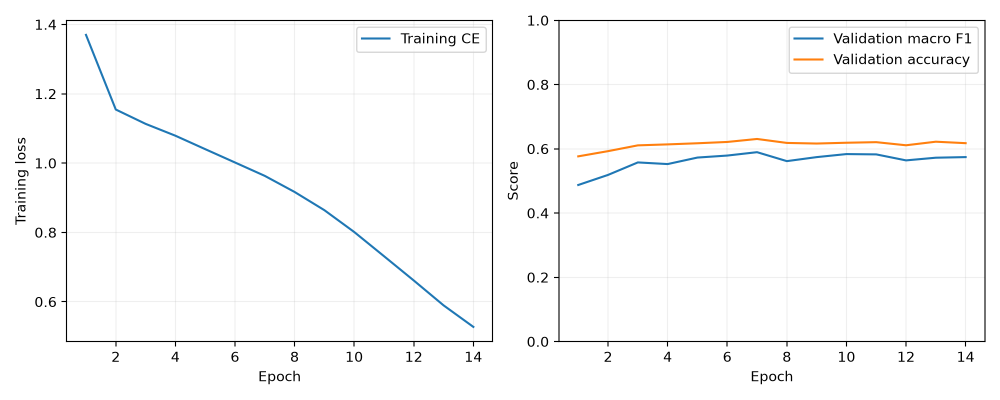
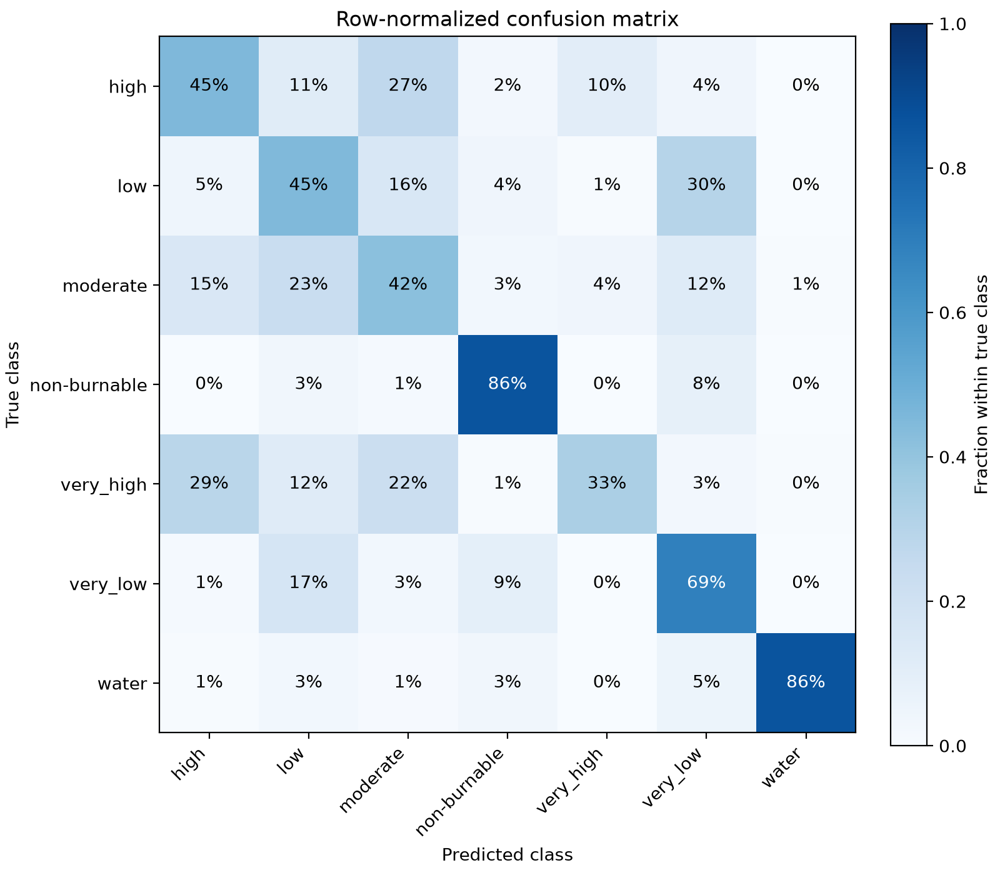

# Initial development experiments

These are **single-seed validation results**, obtained on 2026-10-02.
They validate the end-to-end training system and provide initial transfer
baselines. They are not held-out test results or a state-of-the-art claim.
Both runs use the pinned SigLIP2 base224 vision encoder and the fixed split
recorded in [the implementation checks](validation.md).

| Adaptation | Seed | Best / stopped epoch | Validation accuracy | Validation macro F1 | Training minutes | Peak allocated GPU GiB |
|---|---:|---:|---:|---:|---:|---:|---:|
| Frozen encoder | 42 | 7 / 14 | 55.95% | 50.19% | 12.1 | 0.74 |
| Full fine-tuning | 42 | 7 / 14 | 63.05% | 58.94% | 19.0 | 1.96 |

The frozen encoder used a 15-epoch maximum and full fine-tuning a 30-epoch
maximum; both stopped after seven epochs without a qualifying improvement.
The best checkpoint was selected on validation macro F1. They ran concurrently
on different RTX 5090 GPUs, so wall-clock timings are contextual measurements,
not a controlled throughput benchmark. Peak memory is PyTorch allocated memory,
not total driver/GPU usage.

Test has not been evaluated. Complete validation-only tuning, freeze each
recipe, and repeat independent training seeds before evaluating the final
matrix on test. Validation also selected these checkpoints, so its bootstrap
intervals and calibration scores do not estimate independent test performance.
Initial runs used the working tree during development; final experiments should
use the committed release and record its revision.

The full fine-tuning checkpoint and resumable state are in
`FIRERISK_HOME/runs/siglip2-base-full-seed42`; the corresponding probe files are
in `FIRERISK_HOME/runs/siglip2-base-linear-seed42`. The backbone revision is part
of the saved config; probe/LoRA checkpoints require the frozen pretrained
weights as well. Weight files and source imagery are excluded from Git.

Vector PDF versions are stored alongside the PNGs. Per-run artifacts
also include raw predictions, calibrated metrics, reliability diagrams and
class-level errors. The five ordinal hazard levels have separate coverage
reporting; water and non-burnable are not assigned ordinal risk ranks.
